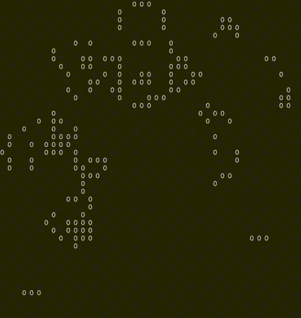

# CS106X: Programming Abstractions in C++

- [CS 106X: Programming Abstractions (Accelerated), Autumn 2017](https://web.stanford.edu/class/archive/cs/cs106x/cs106x.1182/)
- [CS106X: Programming Abstractions in C++ Autumn 2019](https://web.stanford.edu/class/cs106x/)
- [Video Lectures - CS106X: Programming Abstractions in C++ Autumn 2017](https://www.youtube.com/playlist?list=PLoCMsyE1cvdVmbGH6Jp-9twXPbi5J_IBT)

# Assignments

## Game of Life

```
g++ -std=c++11 -o game_of_life game_of_life.cpp
```

You create a random game of life
```
./game_of_life 

```

Or create based on a file
```
./game_of_life files/Glider

```




---

# Lecture 1

- C++, used for systems programming, high speed / efficiency
- `.cpp` and `.h` header files
- `.cpp` -> object file (platform dependent) + libraries -> executable

```cpp
int main () {
    cout << "Your" << age << endl
    return 0;
}
```

## Imports

```cpp
#include <library> // system library
#include "library.h" // local library
```

## Namespace

Avoid name collisions

```cpp
// without namespace std
std::cout << endl;

// with namespace std
using namespace std;
cout << endl;
```

## `cout` and `cin`

Why `cin` is bad? 
- Hard to detect invalid inputs
- Hard to read strings

# Lecture 2

## Functions 

Functions must be declared before used. Prototypes can be used in solve that.

`int`, `char`, `doubles` are passed as values

It's possible to pass them as references but not recommended:

```cpp
void swap(int& a, int& b) {
    int temp = a;
    a = b;
    b = temp;
}
```

## String

Strings are mutable

- C strings (`char` arrays)
- C++ strings (`string` objects)

```cpp
string("text"); // c str -> c++ str
string.c_str(); // c++ str -> c str
```

I did some C++ coding execises, just to get more familiar with the syntax.
Everything is in the LEC2 folder.

# Lecture 3

## Streams

Read and write files

# Lecture 4

## Grids

In the course, the `Grid` class from the stanford library is used but I'm using
a `vector` from the standard lib

```cpp
vector<vector<int>> grid 
```

The grid is automatically passed by value:
- C++ makes a copy of its contents, but this is slow. You should pass by reference with `&`, example: `int sum(Grid<int>& grid)`
- If the code won't modify the grid pass as `const`, example: `int sum(const Grid<int>& grid)`

## Big-oh

# Lecture 5

# Lecture 6

